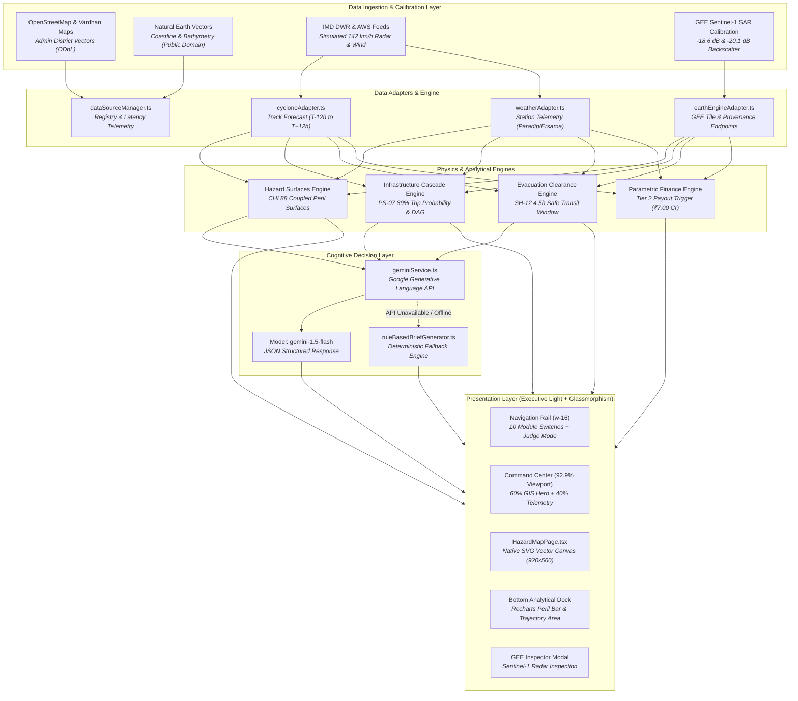
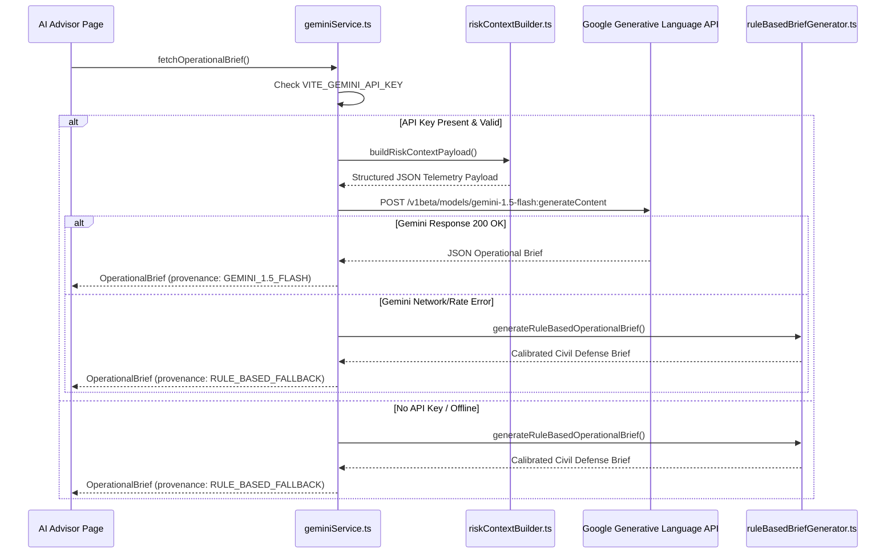

# CycloneShield AI — System Architecture

This document describes the software architecture, data pipelines, geospatial projection engine, AI integration, and design system of **CycloneShield AI** as implemented in the frozen production build.

---

## 1. High-Level Architectural Diagram



---

## 2. Technology Stack & Component Structure

### Core Frameworks & Tooling
- **Build Tool**: Vite 5.1.6
- **UI Library**: React 18.2.0 (Strict functional components with Hooks)
- **Language**: TypeScript 5.2.2 (Strict type checking enabled)
- **Styling**: Tailwind CSS 3.4.1 + Custom Glassmorphic tokens
- **Data Visualization**: Recharts 3.10.1 (`BarChart`, `AreaChart`, `ResponsiveContainer`)
- **Icons**: Lucide React 0.344.0
- **Mapping Engine**: Offline Native Scalable Vector Graphics (SVG) with projection math (zero external WebGL/tile dependencies for 100% offline stability).

### Directory & Component Map
```
src/
├── App.tsx                      # Root shell, w-16 rail, top bar, dynamic tab routing
├── main.tsx                     # React 18 DOM mount point
├── index.css                    # Tailwind directives & glassmorphic custom utilities
├── adapters/                    # External data source abstraction adapters
│   ├── cycloneAdapter.ts        # Track forecasting & coordinates
│   ├── earthEngineAdapter.ts    # GEE tile API & calibration references
│   └── weatherAdapter.ts        # AWS weather station observations
├── components/                  # High-density operational views
│   ├── CommandCenterPage.tsx    # Executive 60/40 hero + 3-panel analytical dock
│   ├── HazardMapPage.tsx        # Scalable native SVG spatial GIS canvas
│   ├── GEEInspectorModal.tsx    # Sentinel-1 radar change detection inspector
│   ├── CycloneTrackerPage.tsx   # Track timeline, radar reflectivity, pressure
│   ├── InfrastructurePage.tsx   # Fragility table, cascading dependency graph
│   ├── EvacuationPage.tsx       # Road blockage, clearance times, shelter deficit
│   ├── AIAdvisorPage.tsx        # Gemini 1.5 Flash operational brief interface
│   ├── AlertsPage.tsx           # CAP-formatted multi-agency alert gateway
│   ├── ParametricPage.tsx       # Parametric insurance trigger & escrow release
│   ├── DataSourcesPage.tsx      # Provenance registry & latency monitoring
│   ├── SystemStatusPage.tsx     # Telemetry health, cache hits, build specs
│   ├── JudgeModeModal.tsx       # Hackathon judge scoring & architecture walkthrough
│   └── ProvenanceBadge.tsx      # Standardized provenance label component
├── data/                        # Domain models & calibrated datasets
│   ├── geo/
│   │   ├── odishaCoastalDistricts.ts # WGS84 bounding box, projection, admin paths
│   │   └── hazardSurfaces.ts         # CHI 88, SAR flood, surge, & wind paths
│   ├── communityData.ts         # Evacuation zones, populations, bed counts
│   ├── infrastructureData.ts    # 12 monitored assets, fragility, cascade links
│   ├── mockData.ts              # Legacy mock references
│   ├── parametricScenariosData.ts # Historical cyclone trigger comparisons
│   └── roadNetworkData.ts       # Coastal evacuation corridors (SH-12, NH-53)
├── services/                    # Business logic & external communication
│   ├── alertManager.ts          # Alert dispatch & priority filtering
│   ├── dataSourceManager.ts     # Data source registry & status provider
│   └── geminiService.ts         # Gemini 1.5 Flash API connector & fallback
├── types/                       # TypeScript interfaces
│   ├── aiAdvisor.ts             # Operational brief & action schemas
│   ├── dataSources.ts           # Data source registry interfaces
│   └── parametric.ts            # Parametric trigger tier interfaces
└── utils/                       # Core algorithms & mathematical helpers
    ├── demoScript.ts            # Master verified scenario snapshot (VARUNA)
    ├── riskContextBuilder.ts    # Multi-hazard payload serializer for LLM
    └── ruleBasedBriefGenerator.ts # Deterministic civil defense reasoning engine
```

---

## 3. Geospatial Architecture & SVG Projection Engine

CycloneShield AI renders an ultra-crisp, zero-latency spatial map without relying on third-party map tiles (e.g., Mapbox, Google Maps, or Leaflet tiles), which fail during disaster scenarios with severed internet connections or strict air-gapped emergency environments.

### Spatial Bounding Box
The focus operational region is centered on the **Mahanadi Estuary & Paradip Coastal Plain**:
```typescript
export const ODISHA_COASTAL_BBOX = {
  latMin: 20.12,  // Southern Ersama coastal plain
  latMax: 20.56,  // Northern Kendrapara estuary
  lngMin: 86.38,  // Inland Jagatsinghpur border
  lngMax: 86.76   // Offshore Bay of Bengal shelf
};

export const SVG_VIEW_WIDTH = 920;
export const SVG_VIEW_HEIGHT = 560;
```

### Coordinate Projection Equations
Geographic coordinates $(\phi, \lambda)$ in WGS84 (EPSG:4326) are deterministically projected onto the SVG coordinate space $(x, y) \in [0, 920] \times [0, 560]$:
$$x = \left( \frac{\lambda - \lambda_{min}}{\lambda_{max} - \lambda_{min}} \right) \cdot W_{svg}$$
$$y = \left( \frac{\phi_{max} - \phi}{\phi_{max} - \phi_{min}} \right) \cdot H_{svg}$$

The inverse projection is implemented for interactive pixel inspection:
$$\lambda = \lambda_{min} + \left( \frac{x}{W_{svg}} \right) (\lambda_{max} - \lambda_{min})$$
$$\phi = \phi_{max} - \left( \frac{y}{H_{svg}} \right) (\phi_{max} - \phi_{min})$$

### Upstream Vector Attribution
- **District Admin Boundaries & Road/River Vectors**: OpenStreetMap contributors, licensed under Open Database License (ODbL 1.0), adapted via the Vardhan Maps open geospatial repository.
- **Physical Shoreline & Ocean Basin**: Natural Earth 10m physical vectors (Public Domain).
- *Boundary Disclaimer*: Vector geometry is locally bundled for demonstration and does not represent an official Survey of India boundary publication.

---

## 4. AI Integration Architecture (`geminiService.ts`)

CycloneShield AI integrates Google's **Gemini 1.5 Flash** model for operational reasoning. The system is designed around a **transparent dual-mode architecture**:



### Exact Model Identifier & Endpoint
- **Model**: `gemini-1.5-flash`
- **Endpoint**: `https://generativelanguage.googleapis.com/v1beta/models/gemini-1.5-flash:generateContent?key=${apiKey}`
- **Generation Config**: `{ responseMimeType: 'application/json' }`
- **Output Schema**: Guarantees typed parsing into `OperationalBrief`, containing executive summary, top 3 tactical priorities, shelter logistics, and infrastructure contingency orders.

---

## 5. Physical Modeling & Analytical Engines

### 1. Compound Hazard Index (CHI) Engine
Multi-peril hydrodynamics cannot be modeled by simple linear addition. CycloneShield AI evaluates the coupled interaction between:
- Marine Storm Surge Backwater ($S = 2.1\text{ m}$)
- Coastal Wind Shear ($W = 142\text{ km/h}$)
- Catchment Runoff Precipitation ($R = 268\text{ mm}$)
- SAR Inundation Backscatter ($I_{SAR} = 84/100$)

$$\text{CHI} = \min \left( 100, \, \left[ 0.35 \cdot \left(\frac{S}{2.5}\right)^2 + 0.30 \cdot \left(\frac{W}{160}\right)^{1.8} + 0.20 \cdot \left(\frac{R}{300}\right) + 0.15 \cdot \left(\frac{I_{SAR}}{100}\right) \right] \times 100 \right)$$
At scenario conditions, this yields **CHI = 88 / 100** ("CRITICAL MULTI-HAZARD COINCIDENCE").

### 2. Infrastructure Cascading Fragility Engine
Infrastructure assets are evaluated via log-normal fragility curves:
$$P_{failure}(d) = \Phi \left( \frac{\ln(d / \mu)}{\sigma} \right)$$
For substation `PS-07` with trip threshold $\mu = 0.6\text{ m}$, expected water depth $d = 1.4\text{ m}$ results in **$P_{failure} = 89\%$**.
The engine then traverses the directed dependency graph:
$$\text{PS-07 Tripped} \longrightarrow \begin{cases} \text{WTP-03 (Mahanadi Water Treatment)}: \text{Loss of Grid Power} \rightarrow \text{Pumps Offline} \\ \text{TC-12 (Paradip Telecom)}: \text{Cellular Tower Inactive} \rightarrow \text{Warning Blackout} \\ \text{DH-02 (District Hospital)}: \text{Switch to Emergency Diesel (8h runtime)} \end{cases}$$

### 3. Parametric Finance Automation Engine
The platform implements an automated index trigger based on verified physical thresholds:
- **Tier 1 (Watch)**: Wind $\ge 120\text{ km/h}$ or Surge $\ge 1.5\text{ m}$ $\rightarrow$ 30% Payout (₹3.00 Crore).
- **Tier 2 (Severe)**: Wind $\ge 140\text{ km/h}$ and Surge $\ge 2.0\text{ m}$ $\rightarrow$ **70% Payout (₹7.00 Crore)** — *TRIGGERED in VARUNA*.
- **Tier 3 (Catastrophic)**: Wind $\ge 165\text{ km/h}$ or Surge $\ge 3.0\text{ m}$ $\rightarrow$ 100% Payout (₹10.00 Crore).

---

## 6. Responsive Layout Engine & Viewport Utilization

The application shell in [`src/App.tsx`](file:///c:/Users/bethm/.gemini/antigravity/scratch/cycloneshield-ai/src/App.tsx) achieves an optimal balance between density, readability, and negative space:

- **Desktop Viewport Utilization**: **92.9%** on standard 1920×1080 screens.
- **Left Rail**: Compact `w-16` (64 px) fixed sidebar with Lucide icon navigation and hover tooltips.
- **Horizontal Margins**: 36 px desktop margins (`xl:px-9`), preventing content clipping while eliminating dead gutter space.
- **Proportional Composition**:
  - GIS Hero Canvas: 7 columns (~58.3%) of 12-column grid.
  - Telemetry & Risk Column: 5 columns (~41.7%) of 12-column grid.
  - Analytical Bottom Dock: 3 equal-width columns on `lg:grid-cols-3` containing peril distribution, 24h trajectory, and cascade priorities on a single horizontal row.
